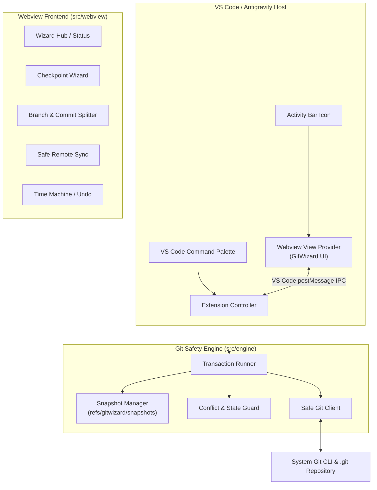

# GitWizard — System Architecture Specification

## 1. Overview & Goals

**GitWizard** is a VS Code / Antigravity / Cursor extension designed for "vibe coders". It bridges the gap between conversational AI iteration and Git by turning complex Git operations into intent-driven visual wizards with guaranteed zero data loss.

---

## 2. Architecture Diagram

---

## 3. Subsystem Breakdown

### 3.1. Git Safety Engine (`src/engine/`)
The engine is completely decoupled from VS Code APIs, allowing it to run in pure Node.js environments and be unit-tested thoroughly without launching a VS Code extension host.

* **`GitClient`**: Typed wrapper around `child_process.execFile("git", ...)` with robust timeout, standard error parsing, and UTF-8 handling.
* **`SnapshotManager`**:
  * Creates low-overhead Git commit objects without moving the user's `HEAD` pointer.
  * Uses `git stash create` and saves refs to `refs/gitwizard/snapshots/<timestamp>-<label>`.
  * Preserves untracked files in local snapshot metadata.
  * Provides instant 1-click restore to any prior snapshot.
* **`TransactionRunner`**:
  * Orchestrates multi-step Git commands sequentially.
  * If any step fails (e.g. exit code non-zero, merge conflict detected), triggers automatic rollback sequence:
    1. Abort in-flight operation (`git merge --abort`, `git rebase --abort`).
    2. Reset working tree to pre-transaction snapshot.
    3. Return clear human-readable error without corrupting repository state.
* **`ConflictGuard`**:
  * Inspects repo state for active conflict markers (`MERGE_HEAD`, `REBASE_HEAD`, `CHERRY_PICK_HEAD`).
  * Prevents destructive commands while conflicts exist.

### 3.2. Intent Wizards (`src/wizards/`)
* **W1: Checkpoint ("Save My State")**:
  * Creates an instant labeled snapshot. Doesn't pollute git commit log.
  * Allows vibe coders to prompt freely, knowing they can hit "Revert" at any time.
* **W2: Split This Mess ("Branch & Commit Splitter")**:
  * Analyzes modified & untracked files.
  * Allows user to select files for Group A and Group B.
  * Automatically creates Branch A, commits Group A, stashes remainder, creates Branch B, commits Group B.
* **W3: Safe Remote Sync ("Sync with Main")**:
  * Pre-checks dirty tree, takes snapshot, fetches remote.
  * Performs rebase or fast-forward merge. If conflict is detected, safely aborts and restores without stranding user in a detached HEAD.
* **W4: Oops, Undo ("Time Machine")**:
  * Parses `git reflog` + snapshot history into a visual timeline.
  * 1-click revert with automated safety snapshot before the revert.

### 3.3. Webview UI (`src/webview/`)
* Seamlessly matches the editor theme (using VS Code CSS variables: `--vscode-foreground`, `--vscode-editor-background`, etc.).
* Zero clunky modals: clear, progressive steps with preview diffs and friendly explanations of what Git commands will run under the hood.

---

## 4. Cost & Token Optimization Strategy for AI Pair Programming
To keep development fast and inexpensive:
1. **Decoupled Architecture**: 100% of the core Git logic is in pure TypeScript (`src/engine/`), meaning tests run via Vitest in under 2 seconds without spinning up VS Code integration runners.
2. **Progressive Disclosure**: Rules are short (`AGENTS.md`), detailed procedures live in `.agents/skills/`, and living state is tracked in `docs/ROADMAP.md`.
